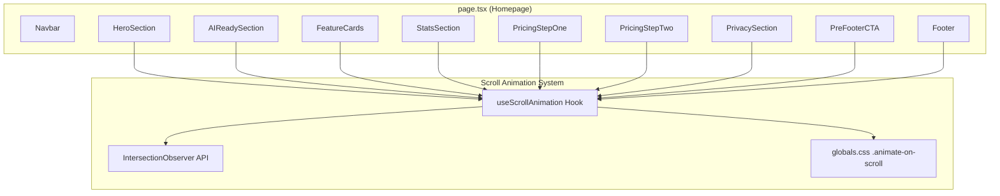
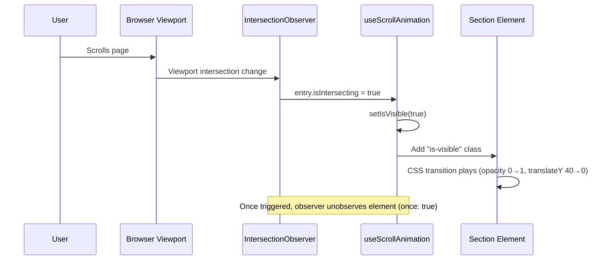
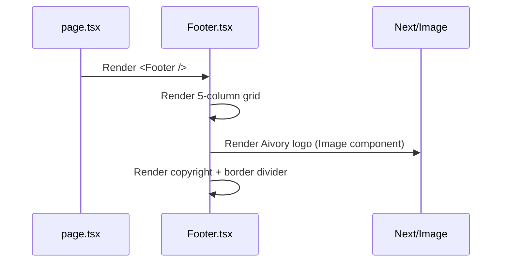

# Design Document: Frontend Footer & Scroll Animations

## Overview

This feature involves two related UI improvements to the Aivory marketing homepage (Next.js + Tailwind CSS):

1. **Footer Redesign** — Replace the current 2-column Footer.tsx layout with a 5-column grid matching the production `index.html` footer. The new footer has columns for Product (6 links), Company (4 links), Legal (3 links), Get in touch (email), and a Logo column on the right, followed by a copyright line with a border divider.

2. **Scroll Fade-In Animations** — Apply the existing `animate-on-scroll` / `is-visible` CSS classes to all homepage sections using the existing `useScrollAnimation` hook (IntersectionObserver-based). Each section fades in with a translateY(40px) → translateY(0) transition as the user scrolls.

Both changes are purely frontend, require no new dependencies, and leverage existing infrastructure (CSS classes, custom hook).

## Architecture



## Sequence Diagrams

### Scroll Animation Flow



### Footer Component Rendering



## Components and Interfaces

### Component 1: Footer (Redesigned)

**Purpose**: Renders the site-wide footer with a 5-column grid layout matching the production design.

**Interface**:
```typescript
// No props needed — self-contained presentational component
export default function Footer(): JSX.Element
```

**Responsibilities**:
- Render 5-column responsive grid (2-col on mobile, 5-col on md+)
- Display Product links (6 items), Company links (4 items), Legal links (3 items), Get in touch (email), Logo
- Render copyright text with top border divider
- Apply consistent hover styling (accent color transition)

### Component 2: ScrollAnimationWrapper (Pattern — applied per section)

**Purpose**: Each section component uses `useScrollAnimation` to conditionally apply the `is-visible` class.

**Interface**:
```typescript
// Pattern used inside each section component
function SectionComponent(): JSX.Element {
  const { ref, isVisible } = useScrollAnimation({ threshold: 0.15 });
  // Wrapping div gets: className={`animate-on-scroll ${isVisible ? 'is-visible' : ''}`} ref={ref}
}
```

**Responsibilities**:
- Observe section visibility via IntersectionObserver
- Toggle `is-visible` class for CSS-driven animation
- Respect `prefers-reduced-motion` (handled by hook + CSS)

### Hook: useScrollAnimation (Existing)

**Purpose**: Encapsulates IntersectionObserver logic for scroll-triggered animations.

**Interface**:
```typescript
interface ScrollAnimationOptions {
  threshold?: number;      // Default 0.15
  rootMargin?: string;     // Default '0px 0px -50px 0px'
  once?: boolean;          // Default true
}

function useScrollAnimation(options?: ScrollAnimationOptions): {
  ref: React.RefObject<HTMLDivElement>;
  isVisible: boolean;
}
```

**Responsibilities**:
- Create IntersectionObserver with configurable threshold/margin
- Track visibility state
- Respect `prefers-reduced-motion` media query
- Cleanup observer on unmount

## Data Models

### Footer Link Data

```typescript
interface FooterLink {
  label: string;
  href: string;
}

interface FooterColumn {
  title: string;
  links: FooterLink[];
}

// Static data arrays
const productLinks: FooterLink[] = [
  { label: 'Deep Diagnostic', href: '#' },
  { label: 'AI Blueprint', href: '#' },
  { label: 'AI Roadmap', href: '#' },
  { label: 'Workflow Builder', href: '#' },
  { label: 'AI Agents', href: '#' },
  { label: 'Template Library', href: '#' },
];

const companyLinks: FooterLink[] = [
  { label: 'About', href: '#' },
  { label: 'Blog', href: '#' },
  { label: 'Careers', href: '#' },
  { label: 'Contact', href: '#' },
];

const legalLinks: FooterLink[] = [
  { label: 'Privacy Policy', href: '#' },
  { label: 'Terms of Service', href: '#' },
  { label: 'Cookie Policy', href: '#' },
];
```

## Key Functions with Formal Specifications

### Function 1: Footer Component Render

```typescript
export default function Footer(): JSX.Element
```

**Preconditions:**
- Next.js Image component available for logo rendering
- Tailwind CSS classes available (grid, responsive breakpoints)
- Logo SVG file exists at appropriate public path

**Postconditions:**
- Renders a `<footer>` with `bg-[#050505]` background
- Contains a 5-column grid (`grid-cols-2 md:grid-cols-5`)
- Product column has exactly 6 links
- Company column has exactly 4 links
- Legal column has exactly 3 links
- Get in touch column contains `hello@aivory.uk` mailto link
- Logo column displays Aivory logo image aligned right on desktop
- Copyright section is below the grid with a top border divider
- All links have hover state transitioning to accent color

### Function 2: useScrollAnimation (Existing — Integration)

```typescript
function useScrollAnimation(options?: ScrollAnimationOptions): { ref, isVisible }
```

**Preconditions:**
- Running in client-side environment (`'use client'` directive)
- Component is mounted in the DOM
- `globals.css` with `.animate-on-scroll` and `.is-visible` classes is loaded

**Postconditions:**
- Returns a `ref` to attach to the target element
- `isVisible` is `false` until element intersects viewport
- `isVisible` becomes `true` once element passes threshold
- If `once: true` (default), observer disconnects after first trigger
- If `prefers-reduced-motion: reduce`, `isVisible` is immediately `true`

**Loop Invariants:** N/A (event-driven, not loop-based)

## Algorithmic Pseudocode

### Scroll Animation Integration Pattern

```typescript
// Pattern applied to each homepage section component
// Each component becomes a client component via 'use client'

'use client';

import { useScrollAnimation } from '@/hooks/useScrollAnimation';

export default function SectionComponent() {
  const { ref, isVisible } = useScrollAnimation({ threshold: 0.15 });

  return (
    <section
      ref={ref}
      className={`animate-on-scroll ${isVisible ? 'is-visible' : ''}`}
    >
      {/* Existing section content unchanged */}
    </section>
  );
}
```

**Preconditions:**
- Component file has `'use client'` directive at top
- `useScrollAnimation` hook is importable from `@/hooks/useScrollAnimation`
- Wrapping element supports `ref` prop (native HTML element)

**Postconditions:**
- Section starts invisible (opacity: 0, translateY: 40px via CSS)
- Section animates in when 15% visible in viewport
- Animation is a one-time trigger (won't re-animate on scroll back up)
- Reduced motion users see content immediately without animation

### Footer Grid Layout Algorithm

```typescript
// Footer renders a responsive grid:
// Mobile: 2 columns (link columns stack in pairs)
// Desktop (md+): 5 columns in single row

// Column order: Product | Company | Legal | Get in touch | Logo
// Below grid: Copyright text, then border-bottom divider

// Grid structure:
// grid-cols-2 md:grid-cols-5 gap-12 md:gap-8
// Logo column: col-span-2 md:col-span-1 (spans full width on mobile)
```

## Example Usage

### Footer Component (Redesigned)

```typescript
import Link from 'next/link';
import Image from 'next/image';

const productLinks = [
  { label: 'Deep Diagnostic', href: '#' },
  { label: 'AI Blueprint', href: '#' },
  { label: 'AI Roadmap', href: '#' },
  { label: 'Workflow Builder', href: '#' },
  { label: 'AI Agents', href: '#' },
  { label: 'Template Library', href: '#' },
];

const companyLinks = [
  { label: 'About', href: '#' },
  { label: 'Blog', href: '#' },
  { label: 'Careers', href: '#' },
  { label: 'Contact', href: '#' },
];

const legalLinks = [
  { label: 'Privacy Policy', href: '#' },
  { label: 'Terms of Service', href: '#' },
  { label: 'Cookie Policy', href: '#' },
];

export default function Footer() {
  return (
    <footer className="w-full bg-[#050505] text-white pt-24 pb-12 font-sans">
      <div className="max-w-7xl mx-auto px-6 md:px-12">
        {/* 5-column grid */}
        <div className="grid grid-cols-2 md:grid-cols-5 gap-12 md:gap-8 mb-32">
          {/* Product */}
          <div className="col-span-1">
            <h4 className="text-gray-500 text-sm font-normal mb-4">Product</h4>
            <ul className="space-y-3 text-sm text-white/90">
              {productLinks.map((link) => (
                <li key={link.label}>
                  <Link href={link.href} className="text-white/90 hover:text-[#0ae8af] transition-colors">
                    {link.label}
                  </Link>
                </li>
              ))}
            </ul>
          </div>

          {/* Company */}
          <div className="col-span-1">
            <h4 className="text-gray-500 text-sm font-normal mb-4">Company</h4>
            <ul className="space-y-3 text-sm text-white/90">
              {companyLinks.map((link) => (
                <li key={link.label}>
                  <Link href={link.href} className="text-white/90 hover:text-[#0ae8af] transition-colors">
                    {link.label}
                  </Link>
                </li>
              ))}
            </ul>
          </div>

          {/* Legal */}
          <div className="col-span-1">
            <h4 className="text-gray-500 text-sm font-normal mb-4">Legal</h4>
            <ul className="space-y-3 text-sm text-white/90">
              {legalLinks.map((link) => (
                <li key={link.label}>
                  <Link href={link.href} className="text-white/90 hover:text-[#0ae8af] transition-colors">
                    {link.label}
                  </Link>
                </li>
              ))}
            </ul>
          </div>

          {/* Get in touch */}
          <div className="col-span-1">
            <h4 className="text-gray-500 text-sm font-normal mb-4">Get in touch</h4>
            <ul className="space-y-3 text-sm text-white/90">
              <li>
                <a href="mailto:hello@aivory.uk" className="text-white/90 hover:text-[#0ae8af] transition-colors">
                  hello@aivory.uk
                </a>
              </li>
            </ul>
          </div>

          {/* Logo */}
          <div className="col-span-2 md:col-span-1 flex md:justify-end mt-8 md:mt-0">
            <div className="flex flex-col items-start">
              <Image
                src="/Aivory logo 2026.svg"
                alt="Aivory Logo"
                width={72}
                height={72}
                className="h-[48px] md:h-[72px] w-auto opacity-90"
              />
            </div>
          </div>
        </div>

        {/* Copyright + Divider */}
        <div className="pb-6 text-sm text-white/80">
          &copy; 2026 Aivory. All rights reserved.
        </div>
        <div className="border-b border-white/20 w-full mb-8"></div>
      </div>
    </footer>
  );
}
```

### Scroll Animation Applied to a Section

```typescript
'use client';

import { useScrollAnimation } from '@/hooks/useScrollAnimation';

export default function AIReadySection() {
  const { ref, isVisible } = useScrollAnimation();

  return (
    <section
      ref={ref}
      className={`animate-on-scroll ${isVisible ? 'is-visible' : ''}`}
    >
      {/* ...existing AIReadySection content... */}
    </section>
  );
}
```

## Correctness Properties

*A property is a characteristic or behavior that should hold true across all valid executions of a system—essentially, a formal statement about what the system should do. Properties serve as the bridge between human-readable specifications and machine-verifiable correctness guarantees.*

### Property 1: Intersection triggers visibility class

*For any* homepage section with the `animate-on-scroll` class, when the IntersectionObserver reports that section is intersecting at ≥15% threshold, the section SHALL receive the `is-visible` class.

**Validates: Requirements 3.1**

### Property 2: All homepage sections have scroll animation

*For any* homepage section component (excluding Navbar), the rendered output SHALL include the `animate-on-scroll` CSS class on its outermost element.

**Validates: Requirements 3.2**

### Property 3: Observer unobserves after first trigger

*For any* section observed by the useScrollAnimation hook with `once: true`, after the IntersectionObserver reports intersection, the observer SHALL call `unobserve` on that element and the `is-visible` class SHALL remain applied permanently.

**Validates: Requirements 4.1, 4.2**

### Property 4: Reduced motion bypasses animation

*For any* invocation of useScrollAnimation when `prefers-reduced-motion: reduce` is active, the hook SHALL return `isVisible: true` immediately without creating an IntersectionObserver, resulting in all sections being visible without transition.

**Validates: Requirements 5.1, 5.2**

## Error Handling

### Error Scenario 1: IntersectionObserver Unsupported

**Condition**: Very old browser without IntersectionObserver API
**Response**: The hook would fail silently (ref attached but no observation). Elements would remain invisible.
**Recovery**: The CSS `animate-on-scroll` class could have a fallback with a `noscript` or timeout approach. In practice, all modern browsers support IntersectionObserver.

### Error Scenario 2: Logo Image Missing

**Condition**: The SVG file is not in the `/public` directory
**Response**: Next/Image would show a broken image or console error
**Recovery**: Ensure the logo SVG is copied to the public folder during migration. Use alt text as fallback.

### Error Scenario 3: Component Not Marked as Client Component

**Condition**: A section component using `useScrollAnimation` lacks `'use client'` directive
**Response**: Next.js build error — hooks cannot be used in Server Components
**Recovery**: Add `'use client'` at the top of any component using the hook.

## Testing Strategy

### Unit Testing Approach

- Verify Footer renders correct number of links per column
- Verify Footer renders correct column headings
- Verify copyright text is present
- Verify all links have correct href attributes
- Verify logo image renders with correct alt text

### Integration Testing Approach

- Verify scroll animation class toggling works with mocked IntersectionObserver
- Verify `is-visible` class is added when observer reports intersection
- Verify `is-visible` is set immediately when `prefers-reduced-motion: reduce` is active
- Verify each homepage section starts with `animate-on-scroll` class

### Visual/Manual Testing

- Scroll through homepage and confirm each section fades in smoothly
- Verify footer matches the 5-column layout on desktop
- Verify footer collapses to 2-column on mobile
- Verify reduced motion preference shows content without animation

## Performance Considerations

- **IntersectionObserver is passive** — No scroll event listeners, no layout thrashing
- **CSS-only animations** — Using `opacity` and `transform` (GPU-composited properties), avoiding layout triggers
- **Once-only observation** — Each section unobserves after triggering, minimizing ongoing work
- **No JavaScript animation library** — Pure CSS transitions triggered by class toggle
- **Static footer data** — Link arrays are compile-time constants, no runtime computation

## Security Considerations

- Footer links use `href="#"` placeholders — no external navigation risks
- Email link uses standard `mailto:` protocol
- No user input or dynamic data in footer
- Logo uses Next/Image which provides optimization and prevents loading arbitrary URLs

## Dependencies

- **Next.js** — `next/link`, `next/image` for footer links and logo
- **React** (via Next.js) — `useEffect`, `useRef`, `useState` in the hook
- **Tailwind CSS** — All styling via utility classes
- **IntersectionObserver API** — Browser-native, no polyfill needed for modern targets
- **Existing infrastructure**:
  - `hooks/useScrollAnimation.ts` — Already implemented
  - `app/globals.css` — Already has `.animate-on-scroll` and `.is-visible` classes
